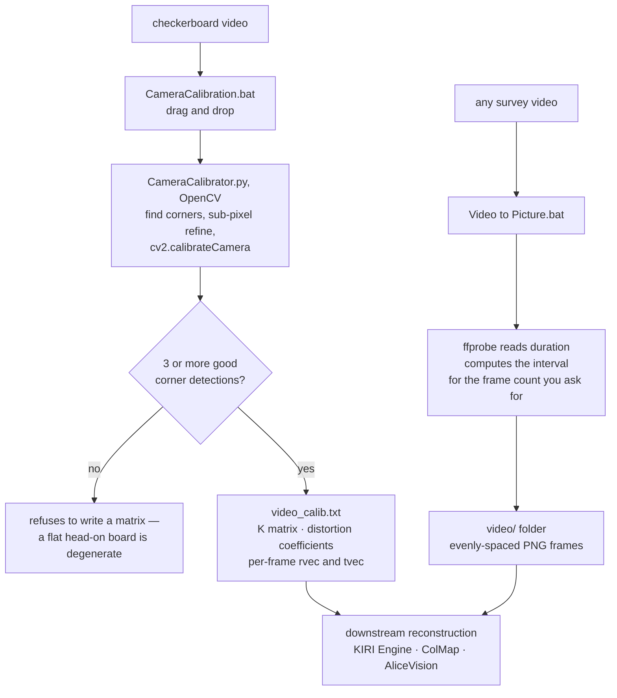

# opencv-photogrammetry

Camera calibration and photogrammetry data preparation, built as a
drag-and-drop desktop workflow. Film a checkerboard, drop it on a
script, and get the intrinsic camera matrix, distortion coefficients,
and per-frame extrinsics — the inputs a photogrammetry / SfM pipeline
needs before any 3D reconstruction.

Written for a subsea/asset-inspection context: camera rigs on ROV and
survey vessels need a known-intrinsics baseline before imagery feeds
into measurement, not after.

## What's in the box

| File | Role |
|---|---|
| `CameraCalibrator.py` | Core calibration engine (OpenCV). Finds checkerboard corners in every video frame, sub-pixel refines them, runs `cv2.calibrateCamera`, writes the full result set to a text file. |
| `CameraCalibration.bat` | Windows front end. Drag a checkerboard video onto it; it runs the Python engine and reports success/failure. |
| `Video to Picture.bat` | Photogrammetry frame extraction. Uses `ffprobe` to read the video duration, asks how many evenly-spaced frames you want, computes the interval, and runs `ffmpeg` to dump PNG frames into a `<video_name>/` folder. |

## Pipeline



Both halves exist for the same reason: a reconstruction is only as good as its inputs. The
intrinsics must be known *before* imagery is measured, and the frame set must be evenly spaced
rather than whatever the operator happened to grab.

## Requirements

- Python 3 with `opencv-python` and `numpy`
  (`pip install opencv-python numpy`)
- **FFmpeg on PATH** (for `Video to Picture.bat` — `ffprobe` and `ffmpeg`)
- A checkerboard video with the default **9×6 inner corners**
  (change `checkerboard_dims` in `CameraCalibrator.py` to match your
  board). `square_size` is the physical size of one square — the output
  matrix is in units of that size, so set it to your real square size
  (e.g. `0.025` for 25 mm) if you need metric intrinsics.

## Usage

**Calibrate** — drag a checkerboard video onto `CameraCalibration.bat`.
Result lands next to the video as `<name>_calib.txt`:

```
INTRINSIC CAMERA MATRIX (K):
[[fx, 0, cx],
 [ 0, fy, cy],
 [ 0,  0,  1]]

DISTORTION COEFFICIENTS (k1,k2,p1,p2,[k3]):
...

--- Frame 000 ---
rvec: ...
tvec: ...
```

**Extract frames** — drag any video onto `Video to Picture.bat`, enter
the frame count you want (e.g. 100 frames across the clip), and it
dumps evenly-spaced PNGs into a folder next to the video.

## Calibration notes

- The engine needs **≥3 good corner detections** across the video or it
  refuses to produce a matrix. Film the board at several tilts and
  positions across the frame — a flat, head-on board alone gives a
  degenerate result.
- Corner refinement uses sub-pixel iteration (`(11,11)` window,
  30 iterations) — that is the difference between a usable and a
  cosmetic calibration.
- The `.gitignore` excludes `*_calib.txt` and any videos/frames by
  default: calibration outputs are per-rig artifacts, not source code.

## Where this sits in the pipeline

This repo is the *preparation* stage: known intrinsics plus a clean,
evenly-spaced frame set. The reconstruction stage — feature matching,
triangulation, dense reconstruction, and meshing — is completed
downstream with **KIRI Engine** (the day-to-day workhorse for quick
turnaround), **ColMap**, and **AliceVision (ALICE)** (the fully
open-source route). The calibrated K matrix and distortion
coefficients written out here feed directly into that stage.

---

MIT + The Commons Clause — see `LICENSE`.
